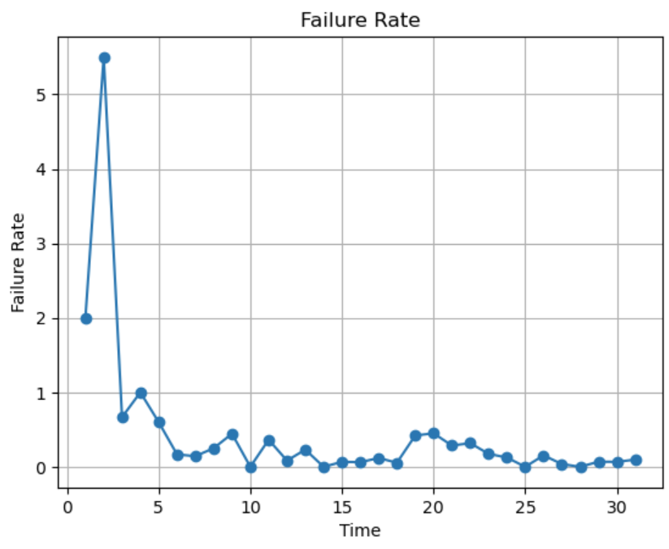

**SENG 637- Dependability and Reliability of Software Systems\***

**Lab. Report \#5 – Software Reliability Assessment**

| Group \#:            |     |
| -------------------- | --- |
| Student Names:       |     |
| Taran Bains          |     |
| Hannah D'Souza       |     |
| Balkarn Gill         |     |
| Satchy Karalasingham |     |
| Chioma Ukaegbu       |     |

# Introduction

In the field of software engineering, ensuring the reliability and dependability of systems is paramount. This lab report for SENG 637, focusing on Software Reliability Assessment, explores the application of two significant methodologies: Reliability Growth Testing (RGT) and Reliability Demonstration Chart (RDC). These methodologies are instrumental in evaluating the performance and reliability of hypothetical software systems based on integration test data.

Reliability Growth Testing involves analyzing failure data to predict and enhance the future reliability of software systems. This method helps in identifying the trends in failure rates over time, providing insights into potential improvements and the effectiveness of corrective actions. On the other hand, Reliability Demonstration Chart is used to determine if a software system meets specified reliability requirements, which is crucial when failure data is limited but needs to be insightful for assessing the system’s performance.

#

# Assessment Using Reliability Growth Testing

## Screenshots

### MVF Plot of All Models & Covariates

### Intensity Graph of All Models & Covariates

### Tables for Comparison and Model Selection

## Selection of Top 2 Models to Provide Best Fit

After analyzing the provided failure data and comparing various models with different covariates, our team identified Discrete Weibull (DW3) and Geometric (GM) models as the best fit for the project data using model ranking.

We used the following models for our comparison: IFR generalized Salvia & Bollinger, S Distribution, Discrete Weibull (Order 2), Discrete Weibull (Type III), Geometric, Negative Binomial (Order 2), and Truncated Logistic. We used Covariates E, F and C for our comparison, and found that covariate F produced the best AIC & BIC scores across all models. Therefore, for our direct model analysis and selection, we compared these scores to determine the selection of our 2 models. As shown in the screenshots above and table below, Discrete Weibull (DW3) and Geometric (GM) using covariate F yielded our best results, and so these 2 models are our selection for best model using Reliability Growth Testing.

| Model Name                                  | Covariate | AIC Score | BIC Score |
| ------------------------------------------- | --------- | --------- | --------- |
| IFR generalized Salvia & Bollinger {IFRGSB} | F         | 126.310   | 132.046   |
| S Distribution {S}                          | F         | 127.323   | 133.059   |
| Discrete Weibull (Order 2) {DW2}            | F         | 173.107   | 177.409   |
| Discrete Weibull (Type III) {DW3}           | F         | 122.199   | 127.935   |
| Geometric {GM}                              | F         | 125.323   | 129.625   |
| Negative Binomial (Order 2) {NB2}           | F         | 152.626   | 156.928   |
| Truncated Logistic {TL}                     | F         | 127.323   | 133.059   |

## Selection of Range of Useful Data

To determine the range of useful data for analysis, we conducted a visual inspection of the cumulative plot of failures over time. Upon examination, we observed that the initial time intervals exhibited a steep increase in failure count, indicating an 'infant mortality' phase where failure rates were high. This phase is typically associated with initial system setup, calibration, or early testing stages, where failures are more common due to initial defects or adjustments.

After interval 4, the plot displayed a more gradual increase in failure count, suggesting a period of relative stability in the system's performance. This stable phase is essential for reliable model fitting and analysis as it represents the system's behavior under more consistent operating conditions.

Therefore, we determined that the range of useful data for model fitting begins after interval 4. We excluded the initial 'infant mortality' phase and focused on the subsequent intervals where the system's performance stabilized. This approach ensures that our analysis captures data points that are representative of the system's reliability under typical operating conditions, leading to more accurate model selection and interpretation.

## Discussion of Acceptable Range of Failure Rate

In assessing the acceptable range of failure rate for the provided test data, several factors must be considered, including project requirements, safety standards, and industry norms.

Upon analysis of the failure data, we observed varying failure rates across different time intervals. It's important to note that failure rates can fluctuate due to factors such as system complexity, environmental conditions, and testing procedures.

For this specific dataset, the failure rate appears to be highest during the initial time intervals, corresponding to the 'infant mortality' phase. This is expected as the system undergoes initial testing and calibration, where defects and vulnerabilities are often identified and addressed.

As the testing progresses, we observe a decrease in the failure rate, indicating potential improvements in the system's reliability over time. The acceptable range of failure rate would depend on the specific requirements and objectives of the project. It's essential to ensure that the observed failure rate aligns with project specifications and reliability targets.

Furthermore, it's crucial to monitor the trend of the failure rate over time. A decreasing trend suggests positive reliability growth, while a stable or increasing trend may indicate underlying issues that require attention.

In conclusion, while there isn't a universally applicable range for failure rate, it's essential to consider project-specific requirements and objectives when determining the acceptable range of failure rate for the test data. Monitoring the trend of the failure rate over time is also important for assessing reliability growth and making informed decisions regarding system improvements and modifications.

### Reliability

The laplace test helps provide a method for assessing the effectiveness of reliability improvement over time. In reliability growth testing, the goal is to identify and correct failures early in the development process to enhance the reliability of the product or system.

By comparing the actual failure data to the expected failure distribution based on reliability improvement goals, the Laplace test helps identify deviations from the expected trend. These deviations can indicate whether the reliability growth process is progressing as anticipated or if further actions are necessary.

As expected, we can see the decreased reliability at the beginning and then the slow decrease does indicate some reliability growth.

### Failure Rate

Below plots the failure rate for the given test data.

## A discussion on decision making given a target failure rate

In software development, target failure rates define the acceptable level of bugs or defects in a released product. Here's how they influence decision making in software testing:

• **Test Planning and Scope:** The target failure rate dictates the testing effort required. A stricter target necessitates more rigorous testing, including a wider range of test cases and potentially more complex testing techniques.

• **Pass/Fail Criteria:** The target directly impacts the decision to release software. If the identified bugs during testing fall within the acceptable failure rate, the software might be considered ready for release. Conversely, exceeding the target could lead to delays for further testing and bug fixing.

• **Risk Management:** Software failures can have varying consequences, ranging from minor inconveniences to critical security breaches. Severity should be factored in alongside the target failure rate. Even a small number of high-severity bugs might necessitate delaying release.

**Challenges in Software Testing:**

• **Estimating Failure Rates:** Unlike hardware systems where physical defects are easier to quantify, software failures can be more nuanced and context-dependent. Estimating a realistic target failure rate can be challenging, especially for complex software.

• **Test Coverage vs. Exhaustive Testing:** It's practically impossible to test every possible scenario for a large software system. Testers have to make strategic decisions about which areas to focus on, aiming to achieve the highest possible code coverage within resource constraints.

## A discussion on the advantages and disadvantages of reliability growth analysis

RGA can be a valuable tool in software testing:

**Advantages:**

• **Early Bug Detection:** By analyzing data from early testing phases (e.g., unit testing, integration testing), RGA can help identify frequent failure modes early on, allowing developers to address them before further development.

• **Prioritizing Test Cases:** RGA pinpoints areas with high failure rates, enabling testers to prioritize those areas with more rigorous testing, optimizing the testing effort.

• **Predicting Release Readiness:** Over time, RGA data can be used to predict the expected failure rate at release based on the current trend, aiding in making informed decisions about delaying or proceeding with release.

• **Cost Savings:** Detecting and fixing defects earlier in the development lifecycle is typically less costly than addressing them after the software has been deployed. Reliability growth analysis helps minimize the cost of defect resolution by identifying issues when they are easier and less expensive to fix.

• **Improved Software Quality:** By systematically addressing defects and vulnerabilities, reliability growth analysis contributes to overall improvements in software quality, reliability, and performance

• **Disadvantages:**

• **Limited Scope:** RGA primarily focuses on identifying and addressing failures encountered during testing. It might not account for real-world usage patterns or unforeseen scenarios.

• **Data Quality Issues:** Inconsistencies or incomplete data from testing can lead to misleading RGA results and impact decision-making.

• **Focus on Quantity over Quality:** Focusing solely on reducing the number of failures might overlook critical bugs with severe consequences.

• **Resource Intensive:** Reliability growth analysis can be resource-intensive, requiring significant time, effort, and resources to execute comprehensive testing activities and address identified defects effectively.

• **Complexity:** Software systems are often complex, with numerous interdependencies and potential failure points. Reliability growth analysis may be challenging in such environments, requiring sophisticated testing techniques and tools to identify and address defects effectively.

• **Uncertainty:** There is inherent uncertainty in predicting software reliability and the effectiveness of reliability growth analysis. Factors such as changing requirements, evolving technology, and unforeseen interactions can impact the reliability of the software and the success of reliability growth efforts.

# Assessment Using Reliability Demonstration Chart

## Explain your evaluation and justification of how you decide the MTTFmin

The corresponding visual depiction in Figure 1 indicates that the system's threshold for a satisfactory Mean Time To Failure (MTTF) is 2 time units. This was established by observing where the failure points intersect with the 'accept' boundary on the RDC graph. Figure 2, which presents an MTTF of 1 time unit, places the system predominantly in the 'reject' area, suggesting an insufficient reliability level at this value. Conversely, Figure 3, illustrating an MTTF of 4 time units, demonstrates a conservative estimate, as the system remains within the 'accept' region across the entire duration.

To pinpoint the MTTFmin, a sensitivity analysis was performed on the available failure data. This method allowed for an investigation into how changes in the MTTF value influenced the system's projected reliability on the Reliability Demonstration Chart (RDC). By adjusting the MTTF value and observing the system's response on the RDC—specifically, whether the observed failures fell within the accept, continue testing, or reject regions—we could determine the most suitable MTTF value.

Through this analysis, we found that an MTTF of 2 units kept the observed failures within the RDC's accept region, suggesting this as the system's minimum reliable operational interval. An MTTF of 1 unit, which pushed the failure line into the reject region, was deemed too frequent and therefore unacceptable. On the other hand, an MTTF of 4 units, which maintained the failure line within the accept region, indicated a more robust than necessary reliability level.

## Advantages and Disadvantages of Reliability Demonstration Chart (RDC)

Advantages: Reliability Demonstration Charts (RDC) offer a clear, visual representation of a system's reliability against specified metrics, such as Mean Time To Failure (MTTF), which aids in straightforward decision-making. They are particularly useful when the available failure data is limited, making them ideal for early testing phases. RDCs allow for flexibility by adjusting confidence levels and risk tolerances to suit various industry standards. Additionally, they enable engineers to simulate 'what-if' scenarios by modifying MTTF values, providing valuable insights into potential changes in system reliability.

Disadvantages: Despite their benefits, RDCs can sometimes oversimplify complex systems, potentially leading to inaccurate reliability assessments. The effectiveness of these charts is highly dependent on the accuracy and completeness of the failure data provided. They are also confined to certain reliability models, which may not be applicable to all systems or failure modes. Furthermore, the simplicity of the chart could lead to misinterpretations, particularly by non-experts, and the proper use of RDC requires a solid understanding of statistical concepts, which adds a layer of complexity in its application.

By understanding these advantages and disadvantages, users can more effectively determine the appropriateness of RDC in their specific testing and reliability evaluation contexts.

# Comparison of Results

Reliability Demonstration Testing (RDT) and Reliability Growth Testing (RGT) are both methods used in testing to assess and improve the reliability of a product. RDT focuses on whether a product meets its reliability requirements/specs before released to customers, while RGT is conducted during development to identify and fix reliability issues before release.

The RGT phase, we focused on DW3 and GM models which seemed most suitable for the data given. After evaluating AIC and BIC across the different models, we found covariate F with the best results. Additionally, we determined the range of useful data for analysis, excluding the initial 'infant mortality' phase and focusing on intervals where the system's performance stabilized. Considering project requirements and monitoring the trend of failure rates over time are essential for defining an acceptable range of failure rate in RGT analysis.

For the RDT phase, the Chart shows that the a mean time to failure (MTTF) of 2 time units represents the minimum reliable operational interval (MTTFmin) for the system, as observed failures consistently remained within the acceptable region on the RDC. Values below this threshold, such as an MTTF of 1 unit, resulted in insufficient reliability, while higher values, such as 4 units, indicated a conservative estimate. The RDC serves as a visual tool to guide decisions regarding the product's reliability level and improvement efforts throughout the testing process.

Overall, RGT and RDT are techniques that are optimized for different things. The RGT helps predict the behaviour of failure trends, and the RDC displays the decision making of when testing can stop based on different factors.

# Discussion on Similarity and Differences of the Two Techniques

Similarities
Both Reliability Growth Testing (RGT) and Reliability Demonstration Chart (RDC) are critical techniques used in assessing the reliability of software systems. Each method aims to evaluate and ensure that systems meet predefined reliability standards before they are deployed. Additionally, RGT and RDC use statistical analysis to interpret failure data, which provides a quantitative basis for decision-making regarding the adequacy of system performance.

Differences
The core difference between RGT and RDC lies in their approach and application within the reliability testing framework. RGT focuses on analyzing failure data over time to model and predict future reliability improvements. It is particularly useful for identifying trends and determining the effectiveness of corrective actions during the development process. In contrast, RDC is used primarily to verify whether a system meets specific reliability targets at a given point in time, based on limited failure data. It is more about validation than prediction, providing a snapshot rather than a trend.

RGT typically involves more continuous and iterative testing where data is accumulated and analyzed throughout the system development lifecycle. This allows for ongoing adjustments and enhancements. On the other hand, RDC tends to be more static, often applied towards the end of the testing process to assess whether final products meet the required standards.

### A discussion on the advantages and disadvantages of reliability growth analysis

RGA can be a valuable tool in software testing:

**Advantages:**

• **Early Bug Detection:** By analyzing data from early testing phases (e.g., unit testing, integration testing), RGA can help identify frequent failure modes early on, allowing developers to address them before further development.

• **Prioritizing Test Cases:** RGA pinpoints areas with high failure rates, enabling testers to prioritize those areas with more rigorous testing, optimizing the testing effort.

• **Predicting Release Readiness:** Over time, RGA data can be used to predict the expected failure rate at release based on the current trend, aiding in making informed decisions about delaying or proceeding with release.

• **Cost Savings:** Detecting and fixing defects earlier in the development lifecycle is typically less costly than addressing them after the software has been deployed. Reliability growth analysis helps minimize the cost of defect resolution by identifying issues when they are easier and less expensive to fix.

• **Improved Software Quality:** By systematically addressing defects and vulnerabilities, reliability growth analysis contributes to overall improvements in software quality, reliability, and performance

• **Disadvantages:**

• **Limited Scope:** RGA primarily focuses on identifying and addressing failures encountered during testing. It might not account for real-world usage patterns or unforeseen scenarios.

• **Data Quality Issues:** Inconsistencies or incomplete data from testing can lead to misleading RGA results and impact decision-making.

• **Focus on Quantity over Quality:** Focusing solely on reducing the number of failures might overlook critical bugs with severe consequences.

• **Resource Intensive:** Reliability growth analysis can be resource-intensive, requiring significant time, effort, and resources to execute comprehensive testing activities and address identified defects effectively.

• **Complexity:** Software systems are often complex, with numerous interdependencies and potential failure points. Reliability growth analysis may be challenging in such environments, requiring sophisticated testing techniques and tools to identify and address defects effectively.

• **Uncertainty:** There is inherent uncertainty in predicting software reliability and the effectiveness of reliability growth analysis. Factors such as changing requirements, evolving technology, and unforeseen interactions can impact the reliability of the software and the success of reliability growth efforts.

# How the team work/effort was divided and managed

The team work was divided equally among all members, ensuring each person had a role that matched their strengths and learning goals. Responsibilities included setting up and running the reliability software, analyzing the data, and documenting the results. Regular virtual meetings were held to track progress, discuss findings, and integrate parts of the report. This collaborative approach facilitated a balanced workload and supported a cohesive final submission.

#

# Difficulties encountered, challenges overcome, and lessons learned

One challenge was interpreting the complex data from the RGT and RDC analyses. Overcoming this involved a lot of self-study and consultation with course materials and external resources. The key lesson learned was the importance of flexibility and persistence in problem-solving within software engineering, as well as the value of a supportive team dynamic.

# Comments/feedback on the lab itself

The lab was an excellent practical application of theoretical concepts learned in class, providing valuable hands-on experience with tools used in the industry.
